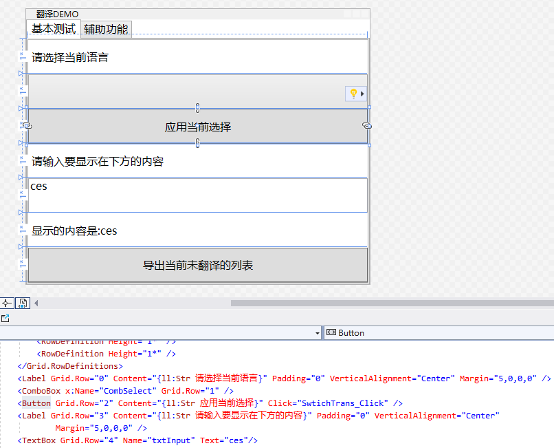
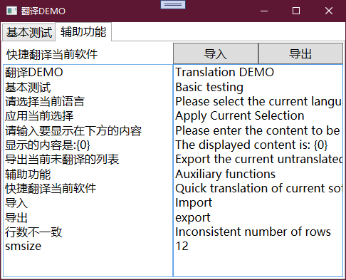

# LinePutScript.Localization.WPF


WPF本地化类库, 轻松让你的wpf应用程序支持多语言

* 支持文本和数值 - 不同语言的控件位置大小
* 支持翻译接口 - 用于网络翻译等
* 支持自动生成所需翻译文档

## 如何使用

### 安装

1. 通过Parckage Manager

```
Install-Package LinePutScript.Localization.WPF
```

1. 通过nuget.org

   [LinePutScript.Localization.WPF](https://www.nuget.org/packages/LinePutScript.Localization.WPF/)

### 在XAML中引用

```xaml
xmlns:ll="clr-namespace:LinePutScript.Localization.WPF;assembly=LinePutScript.Localization.WPF"
```

### 开始翻译

```xaml
<!--未修改前原先代码-->
<Label Grid.Row="0" Content="请选择当前语言" Padding="0" VerticalAlignment="Center" Margin="5,0,0,0" />
<Label Grid.Row="5" VerticalAlignment="Center" Padding="0" Margin="5,0,0,0">
    <Run>显示的内容是:</Run> <Run Text="{Binding Text,ElementName=txtInput}" />
</Label>
<Label Content="快捷翻译当前软件" Grid.ColumnSpan="1" FontSize="16" />

<!--修改后代码-->
<Label Grid.Row="0" Content="{ll:Str 请选择当前语言}" Padding="0" VerticalAlignment="Center" Margin="5,0,0,0" />
<Label Grid.Row="5" Content="{ll:Str 显示的内容是\:{0}, ValueSource={Binding Text,ElementName=txtInput}}" VerticalAlignment="Center" Padding="0" Margin="5,0,0,0" />
<!--数值翻译: 英文太长塞不下,在不同语言中缩小字体-->
<Label Content="{ll:Str 快捷翻译当前软件}" Grid.ColumnSpan="1" FontSize="{ll:Dbe smsize, DefValue=16}" />
```

简单来讲,就是在原先的基础上多加个 `{ll:Str `原先的内容`}` 就可以了

并且修改是及时显示的, 并不会导致设计器无法查看最新的设计, 所见即所得



### 支持的翻译类型

| 类型  | 描述   | 类型   |
| ----- | ------ | ------ |
| Str   | 文本   | String |
| Bool  | 布尔   | Boolen |
| Dbe   | 浮点   | Double |
| Int64 | 长数字 | Long   |
| Int   | 数字   | Int32  |

### 添加翻译文档

```C#
// 本地化:
// 开启翻译存储, 储存所有未翻译的文本,可以在 LocalizeCore.StoreTranslationList 中查看所有未翻译过的文本
LocalizeCore.StoreTranslation = true;
// 加载所有的本地化语言, 通过 LocalizeCore.AddCulture
foreach (var path in new DirectoryInfo(Environment.CurrentDirectory).GetFiles("*.lps"))
    LocalizeCore.AddCulture(path.Name.Split('.')[0], new LPS_D(File.ReadAllText(path.FullName)));
// 加载当前用户使用的默认语言
LocalizeCore.LoadDefaultCulture();
```

### 获取未翻译过的文本

```C#
//在初始化之前先 开启翻译存储, 储存所有未翻译的文本
LocalizeCore.StoreTranslation = true;
//打开程序后在所有UI界面逛一遍,接着获取下面这个List里的文本即可
LocalizeCore.StoreTranslationList;
//或者通过下面这个方法获得制作好的LPS格式文件,可以直接储存
LocalizeCore.StoreTranslationListToLPS();
```

### 代码中翻译

```C#
//调用方法
LocalizeCore.Translate("学习完成啦, 累计学会了 {0:f2} 经验值\n共计花费了{1}分钟", GetCount * 1.2, MaxTime);

//或者用快捷方法
"学习完成啦, 累计学会了 {0:f2} 经验值\n共计花费了{1}分钟".Translate(GetCount * 1.2, MaxTime);

//获取值
LocalizeCore.GetDouble("Size")
```

### 翻译接口

```C#
//翻译接口,实现这个方法以支持自定义翻译
LocalizeCore.TranslateFunc = (txt) => {
    //从网络获取翻译等等
    return txt;
}
```

### 快捷翻译

通过Demo项目 (可在Release中下载), 可以加载LPS文件进行快速翻译. 例如将翻译文本扔到网络翻译中,然后在复制粘贴回来



## Demo 和 案例

详细示例请参见DEMO文件

更多案例参见 (VPet)[https://github.com/LorisYounger/VPet]

## 其他

附语言表 https://learn.microsoft.com/en-us/windows/win32/wmformat/language-strings

顺带一提, 语言采用的是向上兼容, 不用担心填写 `zh-CN` 还是 `zh-Hans` 还是 `zh`, 均会历遍到

